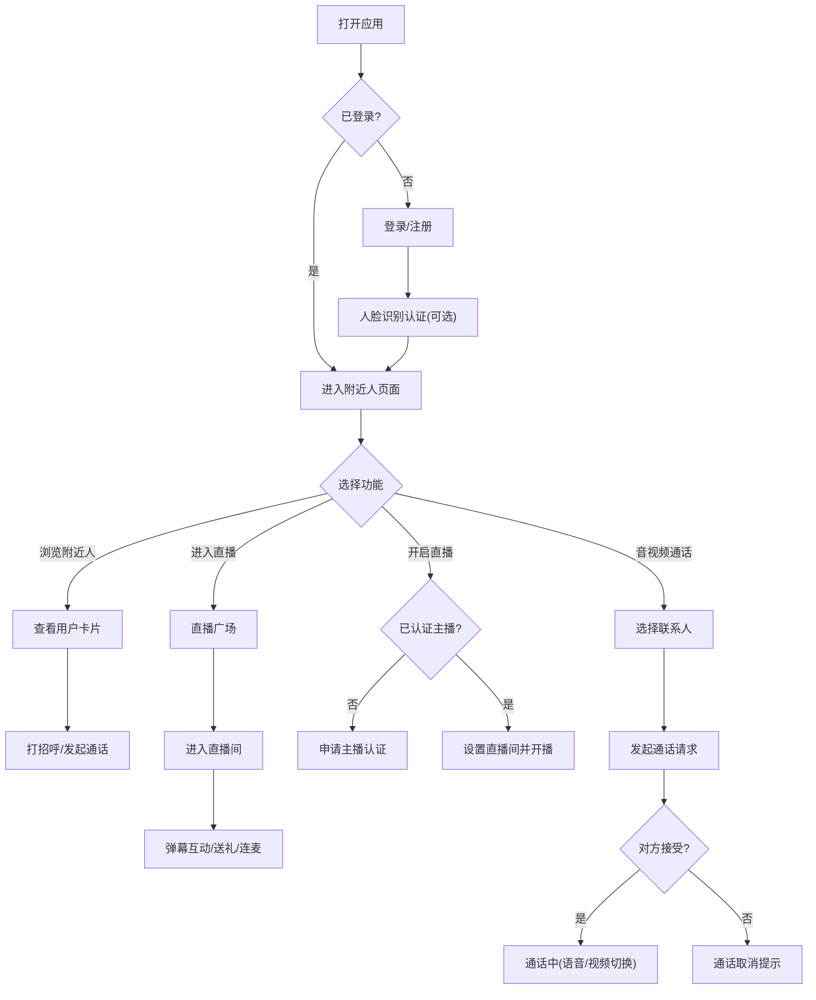

## 1. 产品概述

Crab 是一款面向年轻群体的创新社交通讯应用，融合地理位置社交、人脸识别、实时直播和高质量音视频通话四大核心能力，打造沉浸式社交体验。
- 核心目标：打破陌生人社交壁垒，通过人脸识别增强真实性，用直播和音视频连接全球用户
- 目标用户：18-35 岁追求新颖社交方式、注重互动体验的都市年轻群体
- 产品价值：提供安全、真实、有趣的多元社交场景，建立高质量的社交连接

## 2. 核心功能

### 2.1 用户角色

| 角色 | 注册方式 | 核心权限 |
|------|----------|----------|
| 普通用户 | 手机号/第三方登录 | 浏览附近用户、视频通话、观看直播、人脸识别认证 |
| 认证主播 | 实名认证后申请 | 开启直播、直播间管理、收益提现 |
| 管理员 | 后台账号 | 用户管理、内容审核、直播间监控 |

### 2.2 功能模块

1. **首页/附近人**：用户卡片瀑布流、距离筛选、地图模式、实时在线状态、一键打招呼
2. **人脸识别**：人脸采集、活体检测、人脸比对、实名认证状态、颜值评分
3. **直播广场**：热门直播推荐、分类筛选、直播间入口、开播引导
4. **直播间**：实时视频流、弹幕互动、礼物系统、点赞动画、连麦功能
5. **音视频通话**：1对1视频通话、语音通话模式、通话质量切换、屏幕共享、美颜滤镜
6. **消息中心**：会话列表、系统通知、好友请求、通话记录

### 2.3 页面详情

| 页面名称 | 模块名称 | 功能描述 |
|----------|----------|----------|
| 登录注册页 | 登录表单 | 手机号验证码登录、人脸快捷登录、第三方登录入口 |
| 登录注册页 | 协议条款 | 用户协议勾选、隐私政策展示 |
| 附近人页 | 顶部导航 | Logo、搜索框、筛选按钮、消息入口、个人中心 |
| 附近人页 | 用户卡片列表 | 头像、昵称、年龄、距离、在线状态、兴趣标签、打招呼按钮 |
| 附近人页 | 地图模式切换 | 列表/地图视图切换、位置标记、范围筛选滑块 |
| 人脸识别页 | 人脸采集区 | 摄像头预览框、采集引导动画、光线检测提示 |
| 人脸识别页 | 认证结果 | 认证状态徽章、颜值评分、相似明星推荐 |
| 直播广场页 | 分类标签栏 | 推荐、热门、才艺、游戏、户外、关注 |
| 直播广场页 | 直播封面网格 | 主播头像、标题、观看人数、直播状态标签 |
| 直播间页 | 视频播放区 | 实时视频流、主播信息卡片、关注/分享按钮 |
| 直播间页 | 互动区 | 弹幕滚动列表、弹幕输入框、礼物面板、连麦按钮 |
| 视频通话页 | 视频窗口 | 本地/远端画面切换、画面镜像、全屏模式 |
| 视频通话页 | 控制栏 | 麦克风开关、摄像头开关、静音、挂断、美颜切换、屏幕共享 |
| 消息中心页 | 会话列表 | 最近消息预览、未读红点、在线状态、时间戳 |
| 个人中心页 | 个人资料 | 头像编辑、昵称、个性签名、认证状态展示 |

## 3. 核心流程

用户首次打开应用，进入登录页面完成身份验证；登录后自动进入附近人页面，可浏览周围用户卡片；点击用户卡片可查看详情并发起音视频通话或打招呼；用户可通过人脸识别页面完成真人认证，获得认证标识后可开启直播或提升匹配优先级；在直播广场浏览感兴趣的直播间进入观看，发送弹幕和礼物互动；认证主播可一键开播，与观众实时互动。

## 4. 用户界面设计

### 4.1 设计风格

- **主色调**：深海蓝 `#1A1D2E` 作为主背景，霓虹紫 `#A855F7` 作为品牌色，电光青 `#22D3EE` 作为辅助高亮色
- **次色调**：渐变紫罗兰 `linear-gradient(135deg, #A855F7 0%, #EC4899 100%)` 用于关键按钮和强调元素
- **按钮风格**：圆角胶囊型按钮，渐变填充，悬停时有发光扩散效果；次要按钮采用玻璃拟态半透明背景
- **字体**：显示字体使用 Space Grotesk 作为标题，正文使用 Inter 作为内容字体，数字和图标使用等宽字体
- **布局风格**：深色玻璃拟态(Glassmorphism)设计，卡片采用半透明模糊背景，大量使用圆角和柔和阴影，营造未来科技感
- **图标风格**：使用 Lucide 线性图标，统一 24px 基础尺寸，激活态使用品牌色渐变填充

### 4.2 页面设计概览

| 页面名称 | 模块名称 | UI 元素 |
|----------|----------|----------|
| 登录注册页 | 登录表单 | 玻璃拟态卡片、渐变主按钮、浮动输入框、动态背景粒子 |
| 附近人页 | 用户卡片列表 | 瀑布流双列布局、头像发光边框(在线态)、玻璃卡片、悬浮切换按钮 |
| 人脸识别页 | 人脸采集区 | 扫描线动画、面部轮廓引导框、状态提示条、进度圆环 |
| 直播广场页 | 直播封面网格 | 圆角封面图、渐变遮罩、观看人数徽标、LIVE 闪烁标签 |
| 直播间页 | 视频播放区 | 全屏视频容器、浮动主播信息卡、弹幕飞屏、礼物动画层 |
| 视频通话页 | 视频窗口 | 画中画小窗口、脉冲连接动画、底部半透明控制栏 |
| 消息中心页 | 会话列表 | 左滑操作、未读红点徽标、头像在线小圆点、时间气泡 |
| 个人中心页 | 个人资料 | 圆形头像框(带认证光环)、渐变背景头图、玻璃卡片信息组 |

### 4.3 响应式设计

- 采用 Desktop-first 设计策略，主内容区最大宽度 1280px
- 移动端断点 768px 以下：导航变为底部 Tab 栏，卡片变单列，操作按钮适配触控区域
- 触控目标最小尺寸 44×44px，关键操作按钮增加点击热区
- 字体大小使用 rem 单位自适应，视频通话页横竖屏自动适配

### 4.4 视觉动效

- 页面入场采用渐隐上滑的交错动画(Staggered Reveal)
- 用户卡片悬停时有轻微上浮和光晕扩散效果
- 直播「LIVE」标签使用呼吸闪烁动画
- 人脸识别过程有扫描线上下移动和面部识别框锁定动画
- 礼物送出时有粒子爆裂和飘屏动效
- 通话连接时使用脉冲波纹动画表达连接状态
