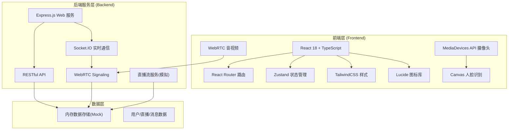
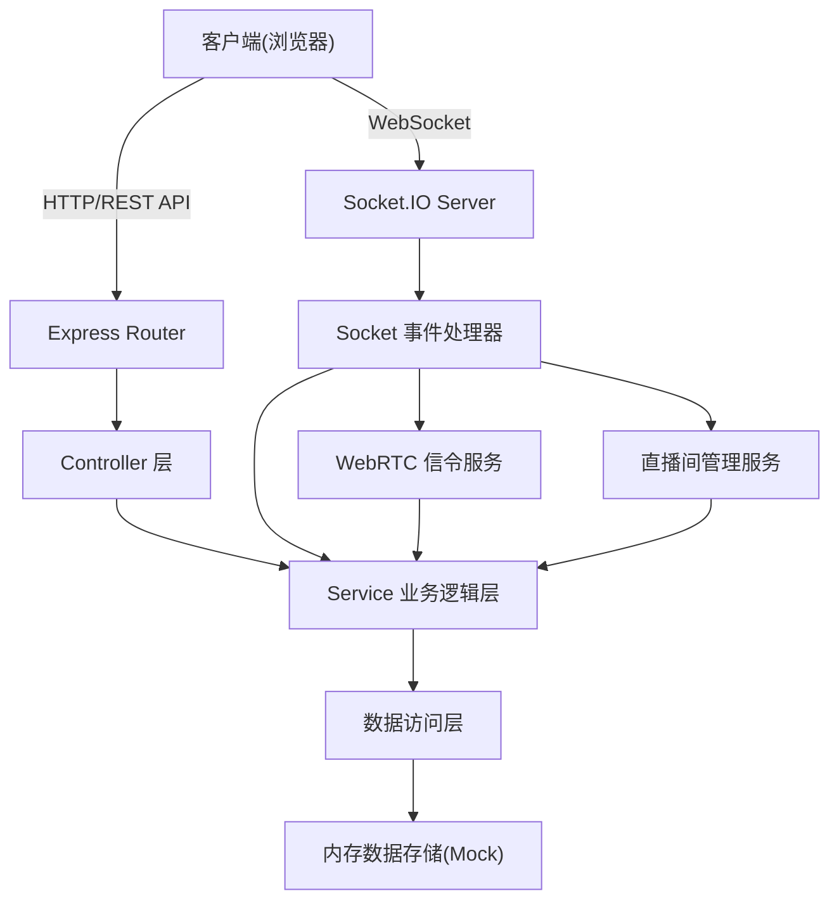
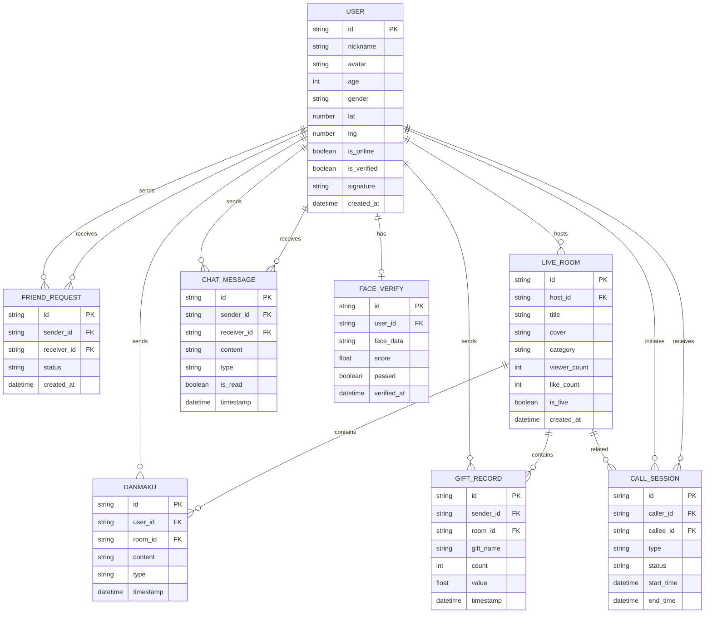

## 1. 架构设计



## 2. 技术描述

- **前端**: React@18 + TypeScript + Vite@5 + React Router DOM@6 + TailwindCSS@3 + Zustand@4 + Lucide React@0.400
- **初始化工具**: vite-init (react-express-ts 模板)
- **后端**: Express@4 + Socket.IO@4
- **音视频**: WebRTC (浏览器原生 API) + Socket.IO 信令服务
- **人脸识别**: MediaDevices API + Canvas API (基于浏览器端人脸检测模拟)
- **数据库**: 内存 Mock 数据，不使用真实数据库
- **实时通信**: Socket.IO 用于直播弹幕、礼物、信令、实时状态同步

## 3. 路由定义

| 路由 | 用途 |
|------|------|
| `/login` | 登录注册页 |
| `/nearby` | 附近人匹配页(首页) |
| `/face-verify` | 人脸识别认证页 |
| `/live` | 直播广场页 |
| `/live/:roomId` | 直播间页 |
| `/call/:userId` | 音视频通话页 |
| `/messages` | 消息中心页 |
| `/profile` | 个人中心页 |

## 4. API 定义

### 4.1 TypeScript 类型定义

```typescript
// 用户类型
interface User {
  id: string;
  nickname: string;
  avatar: string;
  age: number;
  gender: 'male' | 'female';
  distance: number;
  isOnline: boolean;
  isVerified: boolean;
  tags: string[];
  signature: string;
  lastActive: Date;
  location: { lat: number; lng: number };
}

// 直播间类型
interface LiveRoom {
  id: string;
  title: string;
  cover: string;
  hostId: string;
  hostName: string;
  hostAvatar: string;
  category: string;
  viewerCount: number;
  likeCount: number;
  isLive: boolean;
  createdAt: Date;
}

// 弹幕消息
interface DanmakuMessage {
  id: string;
  userId: string;
  userName: string;
  userAvatar: string;
  content: string;
  timestamp: number;
  type: 'text' | 'gift' | 'system';
  gift?: { name: string; icon: string; count: number };
}

// 通话会话
interface CallSession {
  id: string;
  callerId: string;
  calleeId: string;
  type: 'audio' | 'video';
  status: 'calling' | 'connected' | 'ended' | 'rejected';
  startTime?: Date;
  endTime?: Date;
}

// 聊天消息
interface ChatMessage {
  id: string;
  senderId: string;
  receiverId: string;
  content: string;
  type: 'text' | 'image' | 'call_record';
  timestamp: Date;
  isRead: boolean;
}

// 会话
interface Conversation {
  id: string;
  partnerId: string;
  partnerInfo: User;
  lastMessage: string;
  lastMessageTime: Date;
  unreadCount: number;
}
```

### 4.2 REST API 端点

| 方法 | 路径 | 描述 |
|------|------|------|
| GET | `/api/users?lat=&lng=&radius=` | 获取附近用户列表 |
| GET | `/api/users/:id` | 获取用户详情 |
| POST | `/api/users/:id/greet` | 向用户打招呼 |
| POST | `/api/face-verify` | 提交人脸识别数据 |
| GET | `/api/live/rooms?category=` | 获取直播间列表 |
| GET | `/api/live/rooms/:id` | 获取直播间详情 |
| POST | `/api/live/rooms` | 创建直播间(开播) |
| POST | `/api/live/rooms/:id/close` | 关闭直播间 |
| GET | `/api/messages/conversations` | 获取会话列表 |
| GET | `/api/messages/conversations/:id` | 获取会话消息 |
| POST | `/api/messages/send` | 发送消息 |
| POST | `/api/call/initiate` | 发起通话 |
| POST | `/api/call/answer` | 应答通话 |
| POST | `/api/call/end` | 结束通话 |

### 4.3 Socket.IO 事件

| 事件名 | 方向 | 描述 |
|--------|------|------|
| `join_room` | Client→Server | 加入直播间 |
| `leave_room` | Client→Server | 离开直播间 |
| `send_danmaku` | Client→Server | 发送弹幕 |
| `receive_danmaku` | Server→Client | 接收弹幕广播 |
| `send_gift` | Client→Server | 发送礼物 |
| `receive_gift` | Server→Client | 接收礼物广播 |
| `viewer_update` | Server→Client | 观看人数更新 |
| `like` | Client→Server | 点赞 |
| `webrtc_offer` | Client→Server | WebRTC Offer 信令 |
| `webrtc_answer` | Client→Server | WebRTC Answer 信令 |
| `webrtc_ice_candidate` | Client→Server | ICE 候选交换 |
| `incoming_call` | Server→Client | 来电通知 |
| `call_accepted` | Server→Client | 通话被接听 |
| `call_rejected` | Server→Client | 通话被拒绝 |
| `call_ended` | Server→Client | 通话已结束 |
| `user_status` | Server→Client | 用户在线状态更新 |

## 5. 服务器架构图



## 6. 数据模型

### 6.1 ER 图



### 6.2 初始化 Mock 数据

使用内存对象存储预置的模拟数据，包括：
- 20+ 个模拟用户(含位置、头像、兴趣标签)
- 8-10 个模拟直播间(不同分类)
- 预设的聊天消息和弹幕历史
- 系统通知消息
